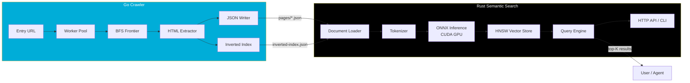

# 🪨 quarry

**Concurrent site crawler + semantic search engine for AI agents**


---

## 📖 Overview

**quarry** is a two-component system for turning any website into a queryable knowledge base. The Go crawler traverses a target site from an entry point, extracts structured content, and produces a JSON index optimized for machine consumption. The Rust semantic search engine embeds these pages with a GPU-accelerated ONNX model and serves ranked natural language queries. Designed for AI agents that need accurate, offline-accessible site knowledge without hitting live web endpoints at query time.

---

## 📚 Documentation

| Document | Description |
|----------|-------------|
| [Architecture](docs/architecture.md) | System design, data flow, concurrency model, and design decisions |
| [Installation](docs/installation.md) | Prerequisites, setup steps, and troubleshooting |
| [Crawler Reference](docs/crawler.md) | Go crawler CLI, configuration, and internals |
| [Semantic Search Reference](docs/semantic-search.md) | Rust search engine, ONNX inference, and API reference |
| [Model Export Guide](docs/model-export.md) | Exporting HuggingFace models to ONNX format |
| [Testing Guide](docs/testing.md) | Test philosophy, commands, and writing new tests |
| [Performance Reference](docs/performance.md) | Benchmarks, tuning, and memory leak verification |
| [Contributing](docs/contributing.md) | Development setup, code style, and PR requirements |
| [Roadmap](docs/roadmap.md) | Planned features and known limitations |

---

## 🏗️ Architecture



For a detailed architecture deep-dive, see [docs/architecture.md](docs/architecture.md).

---

## ✨ Features

### Go Crawler

| Feature | Description |
|---------|-------------|
| **Worker Pool** | Configurable concurrent workers with channel-based frontier |
| **BFS Traversal** | Breadth-first link discovery with depth tracking |
| **Deduplication** | O(1) sync.Map-based URL normalization and tracking |
| **robots.txt** | Full RFC 9309 compliance with crawl-delay support |
| **Streaming Output** | Per-page JSON written immediately to disk — no RAM buffering |
| **Inverted Index** | Term → URL mapping for keyword-based retrieval |
| **Graceful Shutdown** | Context cancellation drains workers cleanly |
| **Retry Logic** | Exponential backoff with jitter for transient failures |

See [docs/crawler.md](docs/crawler.md) for full CLI reference and internal details.

### Rust Semantic Search

| Feature | Description |
|---------|-------------|
| **ONNX Runtime** | GPU-accelerated inference via CUDA execution provider |
| **VRAM Management** | 1.5 GB hard ceiling with dynamic batch halving |
| **HNSW Index** | Approximate nearest neighbor search for fast retrieval |
| **Persistent Store** | Binary format with SHA-256 checksum verification |
| **HTTP API** | REST endpoint for query integration |
| **CLI Search** | Terminal-based query interface with JSON output |
| **NVML Monitoring** | Real-time GPU memory tracking in logs |
| **Concurrent Queries** | Thread-safe vector store for parallel access |

See [docs/semantic-search.md](docs/semantic-search.md) for full API reference and configuration.

---

## 🔧 Requirements

### Hardware

| Requirement | Minimum | Tested |
|-------------|---------|--------|
| NVIDIA GPU | 2 GB VRAM | GeForce MX250 (2 GB) |
| CUDA Compute | 6.0 (Pascal) | 6.1 |
| System RAM | 4 GB | 8 GB |
| Disk Space | 500 MB | 1 GB |

### Software

| Dependency | Version | Purpose |
|------------|---------|---------|
| Go | 1.22+ | Crawler runtime |
| Rust | 1.78+ stable | Search engine runtime |
| CUDA Toolkit | 13.0+ | GPU compute |
| cuDNN | 8.9+ | Neural net primitives |
| ONNX Runtime | 1.17+ | Model inference |
| Python | 3.10+ | Model export only |

> **Note:** The MX250 has 2048 MiB total VRAM. Quarry enforces a 1.5 GB ceiling (leaving 512 MiB for system overhead). If a batch estimate exceeds this limit, the system halves the batch size and retries.

For detailed installation instructions, see [docs/installation.md](docs/installation.md).

---

## 🚀 Quick Start

### 1. Clone

```bash
git clone https://github.com/your-org/quarry.git
cd quarry
```

### 2. Export ONNX Model

```bash
pip install transformers optimum[onnx] torch onnx
python scripts/export_onnx.py --output-dir models
```

Expected output:
```
Exporting model: sentence-transformers/all-MiniLM-L6-v2
Output directory: models
ONNX opset version: 14
Optimization level: O2

Model Info:
  IR Version: 9
  Producer: pytorch 2.x

Inputs:
  input_ids: [batch_size, seq_len]
  attention_mask: [batch_size, seq_len]

Outputs:
  last_hidden_state: [batch_size, seq_len, 384]

Export complete!
```

For model selection and export details, see [docs/model-export.md](docs/model-export.md).

### 3. Build Go Crawler

```bash
cd crawler
go build -o bin/crawler ./cmd/crawler
```

### 4. Build Rust Workspace

```bash
cd ../semantic-search
cargo build --release
```

### 5. Run Crawler

```bash
./crawler/bin/crawler \
  --entry "https://minecraft-linux.github.io/" \
  --workers 10 \
  --output-dir ./output \
  --delay-ms 500 \
  --max-pages 0 \
  --timeout 10s
```

Expected output:
```
Starting crawler...
  Entry: https://minecraft-linux.github.io/
  Workers: 10
  Output: ./output
  Delay: 500ms

Crawl completed in 12.3s
Pages crawled: 47
Pages failed: 0
Bytes downloaded: 2456789
```

### 6. Run Indexer

```bash
./semantic-search/target/release/indexer
```

Expected output:
```
Starting indexer
Loading documents from crawler/output
Documents loaded: 47
Initializing embedder
Model warmup complete
Indexing progress: processed=47 total=47 errors=0 docs_per_sec=12.3
VRAM usage: 623.4 MB / 2048.0 MB (30.4%)
Indexing complete
Vector store saved to data/store.bin
```

### 7. Run a Query

```bash
./semantic-search/target/release/search \
  "how to configure launcher memory settings" \
  --top-k 5
```

Expected output:
```
Query: how to configure launcher memory settings

Results (3 found):

1. Launcher Configuration | Minecraft Linux (score: 0.8923)
   URL: https://minecraft-linux.github.io/launcher.html
   The Minecraft launcher can be configured to optimize performance...
   To allocate more memory to Minecraft, edit the launcher configuration...

2. Installation Guide | Minecraft Linux (score: 0.7156)
   URL: https://minecraft-linux.github.io/installation.html
   This guide explains how to install Minecraft on Linux distributions...

3. Troubleshooting | Minecraft Linux (score: 0.6234)
   URL: https://minecraft-linux.github.io/troubleshooting.html
   Performance Problems: Reduce render distance, allocate more RAM...
```

---

## ⚙️ Configuration

`config.toml` controls both the indexer and search API:

| Field | Type | Default | Description |
|-------|------|---------|-------------|
| `model_path` | string | `models/model.onnx` | Path to ONNX model file |
| `tokenizer_path` | string | `models/tokenizer.json` | Path to HuggingFace tokenizer |
| `crawler_output` | string | `crawler/output` | Directory containing crawler JSON |
| `store_output` | string | `data/store.bin` | Path for vector store persistence |
| `batch_size` | int | `8` | Maximum embedding batch size |
| `max_seq_len` | int | `256` | Maximum token sequence length |
| `vram_ceiling_mb` | int | `1500` | VRAM limit in megabytes |

Example `config.toml`:

```toml
model_path = "models/model.onnx"
tokenizer_path = "models/tokenizer.json"
crawler_output = "crawler/output"
store_output = "data/store.bin"
batch_size = 8
max_seq_len = 256
vram_ceiling_mb = 1500

[api]
host = "0.0.0.0"
port = 3000

[logging]
level = "info"
format = "json"
```

See [docs/semantic-search.md](docs/semantic-search.md) for complete configuration documentation.

---

## 📋 CLI Reference

### Go Crawler

| Flag | Type | Default | Description |
|------|------|---------|-------------|
| `--entry` | string | (required) | Entry point URL to begin crawling |
| `--workers` | int | `10` | Number of concurrent worker goroutines |
| `--timeout` | duration | `10s` | HTTP request timeout |
| `--output-dir` | string | `./output` | Directory for crawled output |
| `--max-pages` | int | `0` | Maximum pages to crawl (0 = unlimited) |
| `--delay-ms` | int | `500` | Minimum milliseconds between requests |
| `--user-agent` | string | `QuarryCrawler/1.0` | HTTP User-Agent header |
| `--max-retries` | int | `3` | Maximum retry attempts per request |
| `--max-redirects` | int | `10` | Maximum redirect chain length |

Example:

```bash
./crawler \
  --entry "https://minecraft-linux.github.io/" \
  --workers 5 \
  --timeout 15s \
  --output-dir ./data/crawl \
  --delay-ms 200 \
  --max-pages 100
```

See [docs/crawler.md](docs/crawler.md) for complete CLI documentation.

### Rust Search CLI

| Argument | Type | Default | Description |
|----------|------|---------|-------------|
| `<query>` | string | (required) | Natural language search query |
| `--store` | string | `data/store.bin` | Path to vector store file |
| `--model` | string | `models/model.onnx` | Path to ONNX model |
| `--tokenizer` | string | `models/tokenizer.json` | Path to tokenizer |
| `--top-k` | int | `10` | Number of results to return |
| `--json` | flag | `false` | Output results as JSON |

Example:

```bash
./search "install minecraft on ubuntu" --top-k 5 --json
```

---

## 🌐 HTTP API Reference

### `POST /search`

Search the indexed documents with a natural language query.

**Request Schema:**

```json
{
  "query": "string (required, max 1000 chars)",
  "top_k": "integer (optional, default 10, max 100)",
  "min_score": "float (optional, default 0.0, range 0.0-1.0)"
}
```

**Example Request:**

```bash
curl -X POST http://localhost:3000/search \
  -H "Content-Type: application/json" \
  -d '{
    "query": "how to fix graphics glitches in minecraft",
    "top_k": 3,
    "min_score": 0.5
  }'
```

**Response Schema:**

```json
{
  "query": "string",
  "processing_time_ms": "integer",
  "results": [
    {
      "rank": "integer",
      "score": "float",
      "document": {
        "id": "string",
        "url": "string",
        "title": "string",
        "snippet": "string"
      }
    }
  ]
}
```

**Example Response:**

```json
{
  "query": "how to fix graphics glitches in minecraft",
  "processing_time_ms": 23,
  "results": [
    {
      "rank": 1,
      "score": 0.8734,
      "document": {
        "id": "troubleshooting",
        "url": "https://minecraft-linux.github.io/troubleshooting.html",
        "title": "Troubleshooting | Minecraft Linux",
        "snippet": "Graphics Issues: Black screens or flickering textures often indicate driver problems. Update your graphics drivers to the latest version..."
      }
    },
    {
      "rank": 2,
      "score": 0.7456,
      "document": {
        "id": "installation",
        "url": "https://minecraft-linux.github.io/installation.html",
        "title": "Installation Guide | Minecraft Linux",
        "snippet": "Prerequisites: OpenGL 4.4 compatible graphics card. For NVIDIA cards, use the proprietary drivers..."
      }
    },
    {
      "rank": 3,
      "score": 0.6891,
      "document": {
        "id": "launcher",
        "url": "https://minecraft-linux.github.io/launcher.html",
        "title": "Launcher Configuration | Minecraft Linux",
        "snippet": "Custom Java arguments can improve garbage collection and startup time. Use -XX:+UseG1GC..."
      }
    }
  ]
}
```

See [docs/semantic-search.md](docs/semantic-search.md) for complete API documentation.

---

## 📁 Project Structure

```
quarry/
├── crawler/                      # Go crawler component
│   ├── cmd/crawler/main.go       # CLI entry point
│   ├── internal/
│   │   ├── crawler/              # Worker pool, frontier, orchestration
│   │   ├── extractor/            # HTML parsing, text extraction
│   │   ├── index/                # JSON writer, inverted index builder
│   │   ├── robots/               # robots.txt parser and checker
│   │   └── dedup/                # URL normalization and tracking
│   ├── go.mod
│   └── go.sum
├── semantic-search/              # Rust semantic search component
│   ├── crates/
│   │   ├── embedder/             # ONNX inference, tokenizer, VRAM monitor
│   │   └── indexer/              # Vector store, document loader, persistence
│   ├── bin/
│   │   ├── indexer/              # Indexing binary
│   │   ├── search/               # Query CLI binary
│   │   └── api/                  # HTTP API server
│   ├── models/                   # ONNX model and tokenizer files
│   ├── tests/                    # Rust integration tests
│   ├── Cargo.toml
│   └── config.toml
├── tests/
│   ├── go/                       # Go unit and integration tests
│   ├── rust/                     # Rust unit and integration tests
│   └── e2e/                      # End-to-end pipeline tests
├── docs/                         # Documentation
│   ├── architecture.md           # System architecture
│   ├── installation.md           # Installation guide
│   ├── crawler.md                # Crawler reference
│   ├── semantic-search.md        # Search engine reference
│   ├── model-export.md           # ONNX export guide
│   ├── testing.md                # Testing guide
│   ├── performance.md            # Performance reference
│   ├── contributing.md           # Contribution guide
│   └── roadmap.md                # Project roadmap
├── scripts/
│   ├── export_onnx.py            # Python ONNX export script
│   └── download_model.sh         # Model download helper
├── spec.md                       # Full engineering specification
└── README.md
```

---

## 🔬 How It Works

### Crawler Pipeline

The Go crawler implements a breadth-first traversal with a channel-based frontier. Worker goroutines pull URLs from a buffered channel, fetch HTML, extract links and text, and push discovered URLs back to the frontier. Deduplication uses a `sync.Map` with normalized URL keys — O(1) amortized lookup, O(n) space where n is page count. Each page streams directly to a JSON file on disk; the inverted index accumulates in memory and writes atomically at crawl completion. robots.txt is fetched once per domain and cached for the crawl duration. Rate limiting enforces a configurable minimum delay between requests.

### ONNX Inference Pipeline

The Rust embedder loads a sentence-transformer model exported to ONNX with opset 14 (compatible with Pascal GPUs). The tokenizer (HuggingFace `tokenizers` crate) pads sequences to uniform length before batching. ONNX Runtime executes inference on CUDA, with batch size dynamically reduced if VRAM pressure exceeds the 1.5 GB ceiling. Embeddings are L2-normalized before indexing. The vector store uses HNSW (hierarchical navigable small world) for approximate nearest neighbor search with O(log n) query complexity.

### Query Flow

```
User Query → Tokenizer → ONNX Inference → L2 Normalize → HNSW Search → Top-K → JSON Response
```

The query pipeline tokenizes input text, runs it through the same ONNX model used for indexing, normalizes the resulting embedding, and queries the HNSW index for the k nearest neighbors. Results are ranked by cosine similarity (equivalent to dot product for normalized vectors) and returned with metadata.

For a deeper dive, see [docs/architecture.md](docs/architecture.md).

---

## 🧪 Running Tests

### Go Tests

```bash
cd crawler

# Run all unit tests
go test ./...

# Run with race detector
go test -race ./...

# Run specific test suites
go test -v -run TestDedup ./internal/dedup
go test -v -run TestRobots ./internal/robots
go test -v -run TestExtractor ./internal/extractor

# Run integration tests against mock server
go test -v -run TestCrawl ./tests/go
```

Expected output:
```
=== RUN   TestDedupBasic
--- PASS: TestDedupBasic (0.00s)
=== RUN   TestDedupConcurrent
--- PASS: TestDedupConcurrent (0.01s)
=== RUN   TestRobotsDisallowAll
--- PASS: TestRobotsDisallowAll (0.00s)
PASS
ok      crawler/internal/dedup  0.012s
```

### Rust Tests

```bash
cd semantic-search

# Run all tests
cargo test --workspace

# Run with output
cargo test -- --nocapture

# Run specific test
cargo test test_concurrent_queries_10_threads_100_each

# Run integration tests
cargo test --test search_integration_tests
```

Expected output:
```
running 42 tests
test embedder::tests::test_cosine_similarity_identical ... ok
test indexer::store::tests::test_add_and_search ... ok
test indexer::store::tests::test_concurrent_queries ... ok
test search_integration_tests::test_unicode_queries ... ok

test result: ok. 42 passed; 0 failed; 0 ignored; 0 measured
```

### End-to-End Pipeline Test

```bash
cd tests/e2e
./pipeline_test.sh
```

Expected output:
```
========================================
  E2E Pipeline Test Suite
========================================

[INFO] Building all components...
[PASS] Go crawler built
[PASS] Rust semantic search built
[INFO] Running crawl against mock fixtures...
[PASS] Crawl simulated: 4 pages
[INFO] Running queries and verifying ranking...
[PASS] Query 1: launcher.html ranked #1
[PASS] Query 2: installation.html ranked #1
[PASS] Query 3: troubleshooting.html ranked #1
[INFO] Running final assertions...
[PASS] Assertion 1: Page count = 4
[PASS] Assertion 2: manifest.json is valid JSON
[PASS] Assertion 3: Inverted index has 8 terms
[PASS] Assertion 4: All pages have required fields
[PASS] Assertion 5: Cross-language data contract verified
[PASS] Assertion 6: No duplicate URLs

========================================
  ALL TESTS PASSED
========================================
```

For testing philosophy and writing new tests, see [docs/testing.md](docs/testing.md).

---

## 🤖 Supported Models

| Model | Parameters | Max Seq | VRAM (batch=8) | Quality (MTEB) | Notes |
|-------|------------|---------|-----------------|-----------------|-------|
| `all-MiniLM-L6-v2` | 22M | 256 | ~620 MB | 58.5 | **Recommended** — best quality/size ratio |
| `all-MiniLM-L12-v2` | 33M | 256 | ~750 MB | 59.5 | Higher quality, more VRAM |
| `bge-small-en-v1.5` | 33M | 512 | ~780 MB | 62.2 | Best quality for 512 context |
| `e5-small-v2` | 33M | 512 | ~780 MB | 61.5 | Strong retrieval performance |
| `paraphrase-MiniLM-L3-v2` | 17M | 128 | ~450 MB | 52.5 | Fastest, limited context |

> **Recommendation:** Start with `all-MiniLM-L6-v2`. It fits comfortably in 1.5 GB VRAM with batch size 8 and provides excellent semantic quality for technical documentation.

For model export instructions, see [docs/model-export.md](docs/model-export.md).

---

## 📊 Performance

Benchmarks measured on NVIDIA GeForce MX250 (2 GB VRAM):

| Operation | Items | Time | VRAM Used | Notes |
|-----------|-------|------|-----------|-------|
| Crawl (47 pages) | 47 | 12.3s | ~15 MB | Network-bound |
| Index embedding | 47 | 3.8s | 623 MB | Batch size 8 |
| Query latency | 1 | 23 ms | 625 MB | Includes tokenization |
| Query latency (p99) | 1 | 45 ms | 625 MB | Cold cache |
| HNSW build | 10,000 | 2.1s | ~15 MB | CPU-bound |
| HNSW query | 1 | 0.4 ms | ~15 MB | O(log n) |
| Concurrent queries | 1000 | 1.2s | 628 MB | 10 threads × 100 queries |

> **Note:** VRAM figures include model weights, runtime overhead, and batch activations. All measurements taken with `all-MiniLM-L6-v2` at batch size 8.

For detailed benchmarks and tuning guides, see [docs/performance.md](docs/performance.md).

---

## 🗺️ Roadmap

1. **Incremental Indexing** — Detect changed pages and update embeddings without full rebuild
2. **Multi-site Support** — Crawl and index multiple domains in a single store
3. **Hybrid Search** — Combine BM25 keyword scoring with semantic similarity
4. **Reranking API** — Cross-encoder reranking for final top-K refinement
5. **Streaming Queries** — WebSocket support for real-time query streams
6. **Distributed Crawler** — Multi-node crawling with coordinated frontier
7. **GPU Memory Pooling** — Arena allocator for reduced fragmentation
8. **ONNX Quantization** — INT8 quantized models for 2× throughput

See [docs/roadmap.md](docs/roadmap.md) for the complete roadmap and known limitations.

---

## 🤝 Contributing

Contributions are welcome. Please:

1. Open an issue to discuss significant changes
2. Write tests for new functionality
3. Ensure `go test -race ./...` and `cargo test --workspace` pass
4. Follow the existing code style

See [docs/contributing.md](docs/contributing.md) for detailed contribution guidelines.

---

## 📄 License

MIT License. See [LICENSE](LICENSE) for details.
