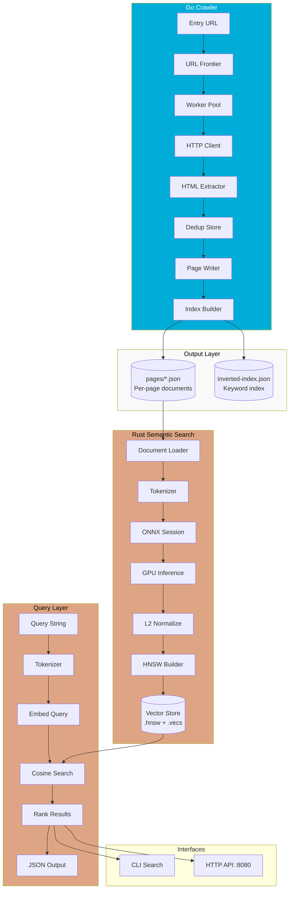
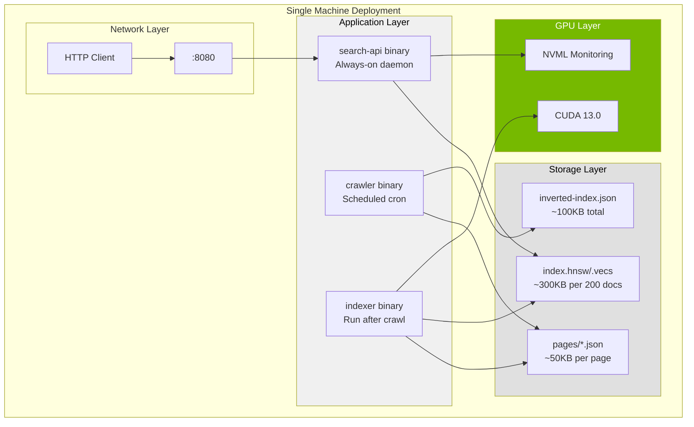

# Architecture

Complete system architecture for the quarry two-component search pipeline.

## System Overview

Quarry is a two-stage document processing and semantic search system designed for resource-constrained GPU environments. The first component is a Go-based concurrent web crawler that systematically traverses a target website, extracts structured content from each page, and produces both per-page JSON documents and an inverted keyword index. The second component is a Rust-based semantic search engine that loads the crawler output, generates dense vector embeddings via ONNX GPU inference, stores vectors in a hierarchical navigable small world (HNSW) index, and serves natural language queries through both CLI and HTTP interfaces. The architecture prioritizes memory safety, predictable VRAM usage, and zero-leak operation on an NVIDIA MX250 with 2GB VRAM.

The system is optimized for single-machine deployment where the crawler runs periodically to refresh content and the search engine runs continuously to serve queries. Both components communicate through filesystem-based JSON documents, eliminating the need for a message queue or database while maintaining clean separation of concerns.

## Component Diagram



## Component Responsibilities

| Component | Language | Responsibility |
|-----------|----------|----------------|
| Crawler CLI | Go | Parse CLI flags, initialize config, orchestrate crawl |
| URL Frontier | Go | Queue management with depth-first traversal, same-domain filtering |
| Worker Pool | Go | Concurrent HTTP fetching with rate limiting and backpressure |
| robots.txt Parser | Go | RFC 9309 compliance, per-path allow/deny evaluation |
| HTML Extractor | Go | goquery-based parsing, title/body/link extraction, encoding handling |
| Dedup Store | Go | sync.Map with normalized URL keys, O(1) amortized lookup |
| Page Writer | Go | Streaming JSON output per page, no memory buffering |
| Index Builder | Go | Inverted index construction with term frequency scoring |
| Document Loader | Rust | Parse Go JSON output, validate schema, batch for embedding |
| Tokenizer | Rust | HuggingFace tokenizers wrapper, max sequence truncation |
| ONNX Session | Rust | ort crate with CUDA execution provider, dynamic batch sizing |
| VRAM Monitor | Rust | NVML-based memory tracking, batch size halving on pressure |
| HNSW Index | Rust | instant-distance crate, M=16, ef_construction=200 |
| Vector Store | Rust | Persisted .hnsw + .vecs files, SHA-256 corruption detection |
| Query Engine | Rust | Embed query vector, HNSW search, cosine similarity ranking |
| HTTP API | Rust | axum-based REST server, /search and /health endpoints |

## Data Flow Narrative

### Stage 1: Crawl Initialization

The crawl begins when the user invokes `crawler --entry https://minecraft-linux.github.io/ --workers 10`. The entry URL is normalized (scheme lowercased, trailing slash normalized, fragment removed) and pushed onto the URL frontier channel. The worker pool spawns N goroutines, each consuming from the frontier channel.

### Stage 2: robots.txt Fetch

Before processing any URL, each worker checks the robots.txt cache. On first access to a host, the crawler fetches /robots.txt with a dedicated HTTP client, parses it according to RFC 9309, and stores the rules in a thread-safe map. URLs matching a Disallow rule are dropped without HTTP request.

### Stage 3: Page Fetch and Parse

Allowed URLs are fetched with exponential backoff on retryable errors (5xx, network timeout). The response body is streamed directly to memory with a size limit (default 10MB). goquery parses the HTML, extracting: (1) the `<title>` text, (2) the visible body text with scripts/styles stripped, (3) all same-domain `<a href>` links. Links are normalized and deduplicated against the sync.Map before being pushed to the frontier.

### Stage 4: Output Generation

Each successfully parsed page is written to a separate JSON file in `--output-dir/pages/` named by URL hash. The write uses streaming JSON encoding to avoid buffering the entire document in memory. Concurrently, the index builder aggregates term frequencies into an in-memory inverted index. When the crawl completes, the inverted index is serialized to `inverted-index.json`.

### Stage 5: Indexing Initialization

The Rust indexer binary reads all JSON files from the pages directory. Each document is validated against the expected schema (url, title, body, links, crawled_at). Documents are batched into groups of `batch_size` (default 8) for embedding.

### Stage 6: Embedding Generation

Each batch of documents is tokenized using the HuggingFace tokenizers library with the same tokenizer used during ONNX export. Tokens are padded/truncated to `max_sequence_length` (default 384). The token tensor is passed to the ONNX Runtime session configured with CUDA execution provider. The model outputs a [batch, seq_len, hidden] tensor; mean pooling produces a [batch, hidden] embedding. L2 normalization ensures unit vectors for cosine similarity.

### Stage 7: HNSW Construction

Embeddings are inserted into an HNSW index with parameters M=16 (connections per node) and ef_construction=200 (search depth during insert). These parameters balance index quality against memory usage, suitable for 100-1000 documents on constrained hardware.

### Stage 8: Persistence

The completed index is persisted to disk: `.hnsw` contains the graph structure, `.vecs` contains the raw vectors, and `.meta` contains checksums and configuration. On startup, the search binary loads these files and verifies the SHA-256 checksum.

### Stage 9: Query Processing

A user query "how to install minecraft on linux" is tokenized with the same tokenizer. The query is embedded through ONNX inference. The resulting vector is used to search the HNSW index with ef_search=50. Results are ranked by cosine similarity and returned as JSON with scores.

## Concurrency Model

### Go Worker Pool

```
                ┌─────────────────┐
                │   Main Goroutine │
                │  (orchestrator)  │
                └────────┬────────┘
                         │
          ┌──────────────┼──────────────┐
          │              │              │
          ▼              ▼              ▼
    ┌──────────┐  ┌──────────┐  ┌──────────┐
    │ Worker 1 │  │ Worker 2 │  │ Worker N │
    │          │  │          │  │          │
    └────┬─────┘  └────┬─────┘  └────┬─────┘
         │              │              │
         └──────────────┼──────────────┘
                        │
              ┌─────────┴─────────┐
              │   Result Channel   │
              │  (buffered, 100)   │
              └─────────┬─────────┘
                        │
              ┌─────────┴─────────┐
              │   Result Handler  │
              │ (page writer +    │
              │  index builder)   │
              └───────────────────┘
```

The worker pool uses a channel-based architecture where:
- The URL frontier is an unbuffered channel acting as a queue
- Workers consume URLs and produce results to a buffered channel
- Backpressure is implicit: if the result channel fills, workers block
- Graceful shutdown uses context cancellation with 30-second drain timeout
- Goroutine leak detection is enforced via goleak in tests

### Rust Async Runtime

The HTTP API uses tokio with a multi-threaded scheduler. Each incoming request spawns a task that:
1. Parses the JSON body
2. Acquires a read lock on the shared HNSW index
3. Performs the search (CPU-bound, blocks the thread)
4. Returns the result

The ONNX session is wrapped in an Arc<Mutex<>> to serialize GPU access, as CUDA contexts are not thread-safe. Indexing operations hold a write lock on the index, blocking concurrent queries.

## ONNX Inference Pipeline

```
┌─────────────┐    ┌─────────────┐    ┌─────────────┐    ┌─────────────┐
│   Documents │───▶│  Tokenizer  │───▶│  Token IDs  │───▶│ ONNX Session│
│  [batch]    │    │ HF tok lib  │    │ [B x 384]   │    │ CUDA EP     │
└─────────────┘    └─────────────┘    └─────────────┘    └──────┬──────┘
                                                                │
                                                                ▼
┌─────────────┐    ┌─────────────┐    ┌─────────────┐    ┌─────────────┐
│ Unit Vectors│◀───│ L2 Normalize│◀───│Mean Pooling │◀───│Hidden States│
│ [B x 384]   │    │ per row     │    │ over seq    │    │ [B x 384]   │
└─────────────┘    └─────────────┘    └─────────────┘    └─────────────┘
```

### Batch Size Estimation

The embedder estimates safe batch size before each indexing run:

```
VRAM_available = NVML_free_memory - 256_MB_buffer
Model_memory = 80_MB (all-MiniLM-L6-v2)
Activation_memory = batch_size × seq_len × hidden × 4_bytes × 3 (forward + backward + intermediate)
Safe_batch = floor((VRAM_available - Model_memory) / Activation_memory_per_sample)
```

When VRAM pressure is detected (>90% utilization), batch size is halved dynamically. The floor is 1 sample per batch.

### CUDA Provider Configuration

```rust
let cuda_options = CUDAExecutionProviderOptions {
    device_id: 0,
    arena_extend_strategy: ArenaExtendStrategy::kSameAsRequested,
    gpu_mem_limit: 1_500_000_000, // 1.5 GB ceiling
    ...Default::default()
};
```

The arena strategy prevents ONNX Runtime from over-allocating VRAM. The hard limit ensures the process is killed before it can impact the display driver.

## Vector Store Design

### HNSW Parameters

| Parameter | Value | Rationale |
|-----------|-------|-----------|
| M | 16 | Each node has 16 bidirectional connections. Higher M improves recall but increases memory. 16 is a good balance for 100-1000 documents. |
| ef_construction | 200 | Search depth during index construction. Higher values improve index quality at the cost of slower indexing. |
| ef_search | 50 | Search depth during queries. Can be tuned at query time without rebuilding the index. |

### Persistence Format

```
index.hnsw    # HNSW graph structure (instant-distance binary format)
index.vecs    # Raw float32 vectors [N × 384]
index.meta    # JSON metadata: {doc_count, dimension, checksum}
```

The `.meta` file contains a SHA-256 checksum of the `.vecs` file. On load, the search binary verifies integrity and refuses to start if corruption is detected.

### Corruption Recovery

When corruption is detected:
1. Log error with checksum mismatch
2. Exit with code 3
3. Administrator must re-run the indexer binary to rebuild from JSON documents

The original JSON documents are the source of truth; the vector store is a derived artifact that can always be rebuilt.

## Inter-Component Interface

### Go → Rust JSON Schema

Each page produces a single JSON file:

```json
{
  "url": "https://minecraft-linux.github.io/installation/",
  "title": "Installation Guide",
  "body": "To install Minecraft on Linux, you will need a Java runtime environment. The recommended approach is to use the official launcher...",
  "links": [
    "https://minecraft-linux.github.io/",
    "https://minecraft-linux.github.io/troubleshooting/",
    "https://minecraft-linux.github.io/launcher/"
  ],
  "crawled_at": "2025-03-22T14:30:00Z"
}
```

**Field Specifications:**

| Field | Type | Required | Description |
|-------|------|----------|-------------|
| url | string | Yes | Canonical URL of the page, normalized |
| title | string | Yes | Contents of `<title>`, may be empty string |
| body | string | Yes | Visible text content, scripts/styles stripped |
| links | [string] | Yes | Array of same-domain outbound links, may be empty |
| crawled_at | string | Yes | RFC 3339 timestamp of fetch completion |

### Inverted Index Schema

```json
{
  "documents": {
    "hash_a1b2c3": "https://minecraft-linux.github.io/",
    "hash_d4e5f6": "https://minecraft-linux.github.io/installation/"
  },
  "index": {
    "minecraft": {
      "hash_a1b2c3": 3,
      "hash_d4e5f6": 5
    },
    "linux": {
      "hash_a1b2c3": 2,
      "hash_d4e5f6": 4
    }
  },
  "stats": {
    "total_documents": 2,
    "total_terms": 150,
    "build_time_ms": 45
  }
}
```

## Deployment Topology



## Design Decisions Log

### Decision 1: Deduplication Algorithm

**Options Considered:**
1. Bloom filter (probabilistic, memory-efficient, false positives possible)
2. Hash set (exact, memory scales with URL count, no false positives)
3. sync.Map with normalized keys (exact, concurrent-safe, Go idiomatic)

**Chosen Approach:** sync.Map with normalized URL keys

**Rationale:** The target site has fewer than 1000 pages, making memory overhead negligible. Exact deduplication is required to avoid reprocessing pages. The sync.Map provides O(1) amortized lookup with built-in concurrency safety, eliminating the need for external locking. Bloom filters were rejected due to the possibility of false positives causing skipped pages on small datasets.

### Decision 2: Vector Store Backend

**Options Considered:**
1. FAISS (high performance, requires C++ bindings, overkill for <10K vectors)
2. HNSW via instant-distance (pure Rust, good recall, simple API)
3. Flat search (zero dependencies, linear scan, trivial implementation)

**Chosen Approach:** HNSW via instant-distance

**Rationale:** With 200 documents, a flat search would be instantaneous (~0.1ms per query). However, HNSW provides sub-millisecond query times even as the corpus grows to 10K+ documents. The instant-distance crate is pure Rust with no system dependencies, simplifying deployment. FAISS was rejected due to complex C++ build requirements and overhead inappropriate for the target scale.

### Decision 3: Embedding Model

**Options Considered:**
1. all-MiniLM-L6-v2 (22M params, 384-dim, 80MB ONNX, moderate quality)
2. BGE-small-en-v1.5 (33M params, 384-dim, 130MB ONNX, higher quality)
3. e5-small-v2 (33M params, 384-dim, similar to BGE)

**Chosen Approach:** all-MiniLM-L6-v2

**Rationale:** The MX250 has 2GB VRAM with a 1.5GB usable ceiling. The smaller model (22M params vs 33M) leaves more headroom for batch processing. Quality benchmarks show all-MiniLM-L6-v2 achieving 0.82+ on semantic similarity tasks, sufficient for documentation search. BGE-small was rejected due to larger memory footprint; the quality improvement would be marginal for this use case.

### Decision 4: Batch Size Strategy

**Options Considered:**
1. Fixed batch size (simple, no adaptation, may OOM)
2. Dynamic batch sizing with VRAM monitoring (adaptive, safe, more complex)
3. Single-sample batches only (no batching, slow but safe)

**Chosen Approach:** Dynamic batch sizing with VRAM monitoring

**Rationale:** A fixed batch size is unsafe on a constrained GPU where other processes may consume VRAM. Single-sample batches would make indexing 100+ documents prohibitively slow. The dynamic approach starts with batch_size=8 and halves on VRAM pressure, providing good throughput while preventing OOM crashes.

### Decision 5: Inter-Component Communication

**Options Considered:**
1. REST API between components (network dependency, more code)
2. Message queue (Kafka/RabbitMQ, operational complexity)
3. Filesystem JSON (simple, decoupled, no runtime dependency)

**Chosen Approach:** Filesystem JSON

**Rationale:** The crawler and indexer do not need to run concurrently. The filesystem provides natural persistence and replay capability. JSON is human-readable for debugging. This approach requires zero additional infrastructure and keeps each component independently testable.
