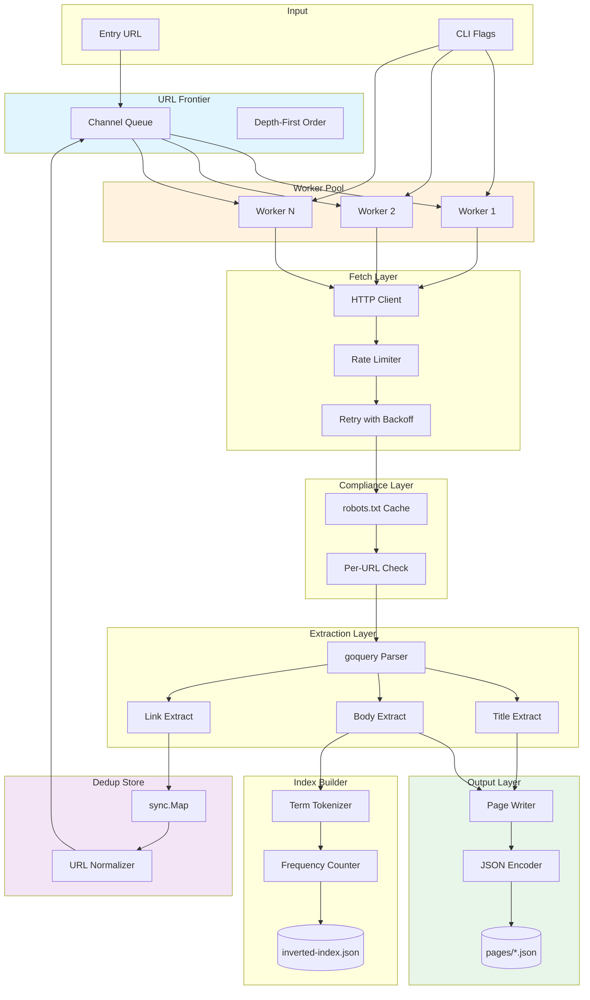

# Crawler Reference

Complete reference for the Go concurrent web crawler and structured indexer.

## Purpose and Scope

The quarry crawler is a concurrent web crawler designed to systematically traverse a target website from a single entry point, extracting structured content from each discovered page. It produces per-page JSON documents containing the URL, title, body text, and outbound links, plus an inverted keyword index for traditional text search. The crawler enforces robots.txt compliance, deduplicates URLs to prevent re-processing, and streams output directly to disk to maintain bounded memory usage regardless of site size.

## Architecture Diagram



## Deduplication Algorithm

### Algorithm: sync.Map with Normalized Keys

The crawler uses Go's `sync.Map` for thread-safe URL deduplication without explicit locking. Each URL is normalized before storage:

1. Parse URL with `net/url.Parse`
2. Convert scheme to lowercase (`HTTPS://` → `https://`)
3. Remove fragment (`#section` → empty)
4. Normalize path (remove trailing slash unless root)
5. Remove default port (`:80` for http, `:443` for https)
6. Remove duplicate slashes in path

### Complexity Analysis

| Metric | Complexity | Explanation |
|--------|------------|-------------|
| Lookup | O(1) amortized | sync.Map provides lock-free reads for existing keys |
| Insert | O(1) amortized | Write path uses compare-and-swap |
| Space | O(n) | One entry per unique URL |
| Normalization | O(k) | k = URL length, typically small |

### Why This Algorithm for minecraft-linux.github.io

The target site has fewer than 1000 pages, making memory overhead negligible (approximately 100KB for 1000 URLs at ~100 bytes each). The sync.Map provides exact deduplication with zero false positives, which is critical for avoiding duplicate fetches. Bloom filters were considered but rejected because the probability of false positives (even at 0.1%) could cause legitimate pages to be skipped, requiring manual intervention.

### Implementation

```go
type DedupStore struct {
    seen sync.Map
}

func (d *DedupStore) Seen(url string) bool {
    normalized := normalizeURL(url)
    _, exists := d.seen.LoadOrStore(normalized, struct{}{})
    return exists
}

func normalizeURL(raw string) string {
    u, err := url.Parse(raw)
    if err != nil {
        return raw
    }
    u.Scheme = strings.ToLower(u.Scheme)
    u.Fragment = ""
    u.Host = strings.ToLower(u.Host)
    // Remove default ports
    host, port, err := net.SplitHostPort(u.Host)
    if err == nil {
        if (u.Scheme == "http" && port == "80") || 
           (u.Scheme == "https" && port == "443") {
            u.Host = host
        }
    }
    // Normalize path
    if u.Path != "/" {
        u.Path = strings.TrimSuffix(u.Path, "/")
    }
    u.Path = regexp.MustCompile(`/+`).ReplaceAllString(u.Path, "/")
    return u.String()
}
```

## Worker Pool Design

### Goroutine Lifecycle

```
                    ┌─────────────────┐
                    │   Main Routine  │
                    │  (orchestrator) │
                    └────────┬────────┘
                             │ spawns
          ┌──────────────────┼──────────────────┐
          │                  │                  │
          ▼                  ▼                  ▼
    ┌───────────┐      ┌───────────┐      ┌───────────┐
    │  Worker 1 │      │  Worker 2 │      │  Worker N │
    │           │      │           │      │           │
    │ ┌───────┐ │      │ ┌───────┐ │      │ ┌───────┐ │
    │ │fetch  │ │      │ │fetch  │ │      │ │fetch  │ │
    │ │parse  │ │      │ │parse  │ │      │ │parse  │ │
    │ │write  │ │      │ │write  │ │      │ │write  │ │
    │ └───────┘ │      │ └───────┘ │      │ └───────┘ │
    └─────┬─────┘      └─────┬─────┘      └─────┬─────┘
          │                  │                  │
          └──────────────────┼──────────────────┘
                             │ signals
                             ▼
                    ┌─────────────────┐
                    │  Result Channel │
                    │  (buffered 100) │
                    └────────┬────────┘
                             │
                             ▼
                    ┌─────────────────┐
                    │ Result Handler  │
                    │ (serial write)  │
                    └─────────────────┘
```

### Channel Topology

```go
type Pool struct {
    urls      chan string      // URL frontier (unbuffered, acts as queue)
    results   chan *PageResult // Results (buffered, provides backpressure)
    workers   int              // Number of worker goroutines
    wg        sync.WaitGroup   // Tracks active workers
    ctx       context.Context  // Cancellation signal
    cancel    context.CancelFunc
}

func (p *Pool) Start() {
    for i := 0; i < p.workers; i++ {
        p.wg.Add(1)
        go p.worker(i)
    }
    go p.resultHandler()
}

func (p *Pool) worker(id int) {
    defer p.wg.Done()
    for {
        select {
        case url, ok := <-p.urls:
            if !ok {
                return
            }
            result := p.fetchAndParse(url)
            p.results <- result
        case <-p.ctx.Done():
            return
        }
    }
}
```

### Backpressure Mechanism

The backpressure mechanism ensures that fast workers cannot overwhelm the result handler:

1. **URL Channel**: Unbuffered, acts as a synchronized queue. Workers block when no URLs are available.

2. **Result Channel**: Buffered to 100 items. When full, workers block on send, naturally throttling fetch rate.

3. **Rate Limiter**: Per-host rate limiting via a token bucket. Default: 1 request per 100ms per host.

4. **Memory Bounding**: Pages larger than 10MB are rejected before parsing, preventing memory exhaustion.

### Graceful Shutdown

```go
func (p *Pool) Shutdown(timeout time.Duration) {
    // Signal workers to stop
    p.cancel()
    
    // Wait for workers with timeout
    done := make(chan struct{})
    go func() {
        p.wg.Wait()
        close(done)
    }()
    
    select {
    case <-done:
        close(p.results)
    case <-time.After(timeout):
        log.Error("Shutdown timeout, some workers may have leaked")
    }
}
```

## robots.txt Compliance

### Fetch Strategy

1. On first access to a host, fetch `/robots.txt` before any page
2. Cache the parsed rules in a thread-safe map
3. Subsequent requests to the same host use the cached rules
4. If robots.txt fetch fails (404, timeout), allow all by default
5. Re-fetch robots.txt every 24 hours (cache TTL)

### Parse Logic (RFC 9309)

```go
type RobotsRule struct {
    UserAgent  string
    AllowPaths []string
    Disallow   []string
    CrawlDelay time.Duration
}

func (r *RobotsRule) Allowed(urlPath string, userAgent string) bool {
    // Find longest matching rule
    var longestAllow string
    var longestDisallow string
    
    for _, pattern := range r.AllowPaths {
        if matchPath(urlPath, pattern) && len(pattern) > len(longestAllow) {
            longestAllow = pattern
        }
    }
    
    for _, pattern := range r.Disallow {
        if matchPath(urlPath, pattern) && len(pattern) > len(longestDisallow) {
            longestDisallow = pattern
        }
    }
    
    // Disallow wins on tie (more specific rule wins)
    if len(longestAllow) >= len(longestDisallow) {
        return true
    }
    return false
}
```

### Per-URL Enforcement

Before each fetch:
1. Extract host from URL
2. Lookup cached robots.txt for host
3. Check URL path against rules
4. If disallowed, skip URL and log at INFO level

### Edge Cases

| Edge Case | Behavior |
|-----------|----------|
| No robots.txt (404) | Allow all URLs |
| robots.txt timeout | Allow all URLs, log warning |
| `Disallow: /` | Block all URLs |
| `Disallow:` (empty) | Allow all URLs |
| `User-agent: *` | Matches any crawler user-agent |
| `Crawl-delay: 10` | Add 10 second delay between requests |
| Wildcards in path | Not supported (exact prefix match only) |
| Multiple user-agent groups | Use first matching group |

## HTML Extraction

### What Is Extracted

| Field | Source | Processing |
|-------|--------|------------|
| title | `<title>` element | Strip whitespace, decode HTML entities |
| body | Text content of `<body>` | Remove `<script>`, `<style>`, `<nav>`, `<footer>`, `<header>`, collapse whitespace |
| links | `href` attribute of `<a>` elements | Resolve relative URLs, filter to same-domain only |

### What Is Stripped

- `<script>` and `<style>` tags and their contents
- HTML comments
- `<nav>`, `<footer>`, `<header>` elements (non-content areas)
- Hidden elements (`display: none`, `visibility: hidden`)
- Inline CSS and JavaScript attributes

### Encoding Handling

```go
func decodeBody(resp *http.Response, body []byte) (string, error) {
    // Check Content-Type header for charset
    contentType := resp.Header.Get("Content-Type")
    if strings.Contains(contentType, "charset=") {
        charset := extractCharset(contentType)
        if charset != "" && charset != "utf-8" {
            decoder := charmap.Windows1252.NewDecoder()
            body, _ = decoder.Bytes(body)
        }
    }
    
    // Check for <meta charset="...">
    if !utf8.Valid(body) {
        // Attempt to detect encoding from meta tags
        if detected := detectCharsetFromMeta(body); detected != "" {
            body = transcode(body, detected, "utf-8")
        }
    }
    
    return string(body), nil
}
```

## Output Formats

### Per-Page JSON Schema

Each crawled page produces a single JSON file named by URL hash:

```json
{
  "url": "https://minecraft-linux.github.io/installation/",
  "title": "Installation Guide - Minecraft Linux",
  "body": "To install Minecraft on Linux, you will need a Java runtime environment. The recommended approach is to use the official launcher from Mojang. Alternatively, you can use open-source launchers like HMCL or Prism Launcher. First, ensure you have a compatible Java version installed. For Minecraft 1.18 and later, Java 17 is required...",
  "links": [
    "https://minecraft-linux.github.io/",
    "https://minecraft-linux.github.io/troubleshooting/",
    "https://minecraft-linux.github.io/launcher/",
    "https://minecraft-linux.github.io/faq/"
  ],
  "crawled_at": "2025-03-22T14:30:00Z"
}
```

**Field Specifications:**

| Field | Type | Description |
|-------|------|-------------|
| url | string | Canonical URL of the page after normalization |
| title | string | Contents of `<title>` element, empty string if missing |
| body | string | Visible text content with scripts/styles removed |
| links | array of strings | Same-domain outbound links from `<a href>` elements |
| crawled_at | string | RFC 3339 timestamp when the page was successfully fetched |

**File Naming:**

Files are named using the first 12 characters of SHA-256 hash of the normalized URL:
```
pages/a1b2c3d4e5f6.json
pages/7890abcdef12.json
```

### Inverted Index Schema

```json
{
  "documents": {
    "a1b2c3d4e5f6": "https://minecraft-linux.github.io/",
    "7890abcdef12": "https://minecraft-linux.github.io/installation/",
    "34567890abcd": "https://minecraft-linux.github.io/troubleshooting/"
  },
  "index": {
    "minecraft": {
      "a1b2c3d4e5f6": 5,
      "7890abcdef12": 8,
      "34567890abcd": 3
    },
    "linux": {
      "a1b2c3d4e5f6": 3,
      "7890abcdef12": 6
    },
    "java": {
      "7890abcdef12": 4,
      "34567890abcd": 2
    },
    "install": {
      "a1b2c3d4e5f6": 1,
      "7890abcdef12": 5
    },
    "launcher": {
      "a1b2c3d4e5f6": 1,
      "7890abcdef12": 3
    }
  },
  "stats": {
    "total_documents": 3,
    "total_terms": 150,
    "build_time_ms": 12,
    "crawl_completed_at": "2025-03-22T14:35:00Z"
  }
}
```

**Field Specifications:**

| Field | Type | Description |
|-------|------|-------------|
| documents | object | Maps document hash to URL |
| index | object | Maps term to document-frequency pairs |
| stats.total_documents | integer | Number of documents indexed |
| stats.total_terms | integer | Number of unique terms |
| stats.build_time_ms | integer | Time to build index in milliseconds |

## CLI Reference

| Flag | Type | Default | Description |
|------|------|---------|-------------|
| `--entry` | string | (required) | Entry point URL to start crawling |
| `--workers` | int | 10 | Number of concurrent worker goroutines |
| `--timeout` | int | 30000 | HTTP request timeout in milliseconds |
| `--output-dir` | string | ./output | Directory for JSON output files |
| `--max-pages` | int | 1000 | Maximum pages to crawl before stopping |
| `--delay-ms` | int | 100 | Minimum delay between requests to same host |
| `--user-agent` | string | quarry/1.0 | User-Agent header for HTTP requests |
| `--max-retries` | int | 3 | Maximum retry attempts for failed requests |
| `--max-body-size` | int | 10485760 | Maximum response body size in bytes (10MB) |
| `--verbose` | bool | false | Enable debug logging |
| `--help` | bool | false | Show help message |

### Example Commands

```bash
# Basic crawl with defaults
./crawler --entry https://minecraft-linux.github.io/

# Crawl with custom workers and output directory
./crawler --entry https://example.com --workers 5 --output-dir ./data

# Crawl with rate limiting and max pages
./crawler --entry https://example.com --delay-ms 500 --max-pages 100

# Verbose crawl for debugging
./crawler --entry https://example.com --verbose --workers 1
```

## Environment Variables

| Variable | Default | Description |
|----------|---------|-------------|
| `CRAWLER_WORKERS` | 10 | Override default worker count |
| `CRAWLER_TIMEOUT` | 30000 | Override default timeout |
| `CRAWLER_OUTPUT_DIR` | ./output | Override default output directory |
| `CRAWLER_USER_AGENT` | quarry/1.0 | Override default user-agent |
| `HTTP_PROXY` | (none) | HTTP proxy URL for requests |
| `HTTPS_PROXY` | (none) | HTTPS proxy URL for requests |
| `NO_PROXY` | (none) | Hosts to bypass proxy |

Environment variables are overridden by CLI flags when both are specified.

## Performance Tuning

### Worker Count Guidelines

| Site Size | Recommended Workers | Rationale |
|-----------|---------------------|-----------|
| < 100 pages | 3-5 | Small sites benefit from lower concurrency to avoid rate limiting |
| 100-500 pages | 5-10 | Balance between speed and server load |
| 500-2000 pages | 10-20 | Higher throughput, ensure delay-ms is sufficient |
| > 2000 pages | 15-30 | Maximum practical for most servers |

### Delay Recommendations

| Target Site | Recommended delay-ms | Notes |
|-------------|---------------------|-------|
| Static site (GitHub Pages) | 50-100 | Generally no rate limits |
| Blog/CMS | 100-200 | Be respectful of shared hosting |
| API endpoints | 200-500 | Check API documentation |
| Unknown | 200 | Start conservative, increase if 429s occur |

### Memory Estimation

```
Memory (MB) ≈ workers × 5 MB + page_count × 0.1 MB

Example: 10 workers, 500 pages
Memory ≈ 10 × 5 + 500 × 0.1 = 50 + 50 = 100 MB
```

## Known Limitations

| Limitation | Description | Workaround |
|------------|-------------|------------|
| Same-domain only | Only follows links within the entry URL's domain | Run separate crawls for each domain |
| No JavaScript rendering | Cannot execute client-side JavaScript | Use a headless browser crawler for SPAs |
| Max redirect depth | Stops after 10 redirects per URL | Increase via code modification |
| No form submission | Cannot submit forms or interact with inputs | Manual form analysis required |
| No authentication | Cannot handle login-protected pages | Provide cookies via environment (future feature) |
| Wildcard robots.txt | Does not support `*` wildcards in robots.txt | Exact path matching only |

## Error Handling Matrix

| Error Condition | Behavior | Output | Exit Code |
|-----------------|----------|--------|-----------|
| Entry URL unreachable | Exit immediately | Error to stderr | 1 |
| All requests timeout | Complete with partial results | Warning logs, partial JSON files | 0 |
| HTTP 429 (rate limited) | Exponential backoff, retry up to 3 times | Warning log per retry | 0 (if resolved) |
| HTTP 403 (forbidden) | Skip URL, log warning | Warning log | 0 |
| HTTP 404 (not found) | Skip URL, log info | Info log | 0 |
| HTTP 5xx (server error) | Retry with backoff, max 3 attempts | Warning log per retry | 0 (if resolved) |
| robots.txt disallows all | Exit with message | Error to stderr | 2 |
| Invalid SSL certificate | Skip URL, log warning | Warning log | 0 |
| Response too large | Skip URL, log warning | Warning log | 0 |
| Non-UTF8 content | Attempt transcoding, log warning | Transcoded content | 0 |
| Goroutine leak detected | Test failure with stack trace | Error in test output | 1 (test only) |
| Out of memory | Process killed by OS | No output | 137 (SIGKILL) |
| Context cancelled | Graceful shutdown | Info log | 0 |
| Disk full | Exit immediately | Error to stderr | 1 |
